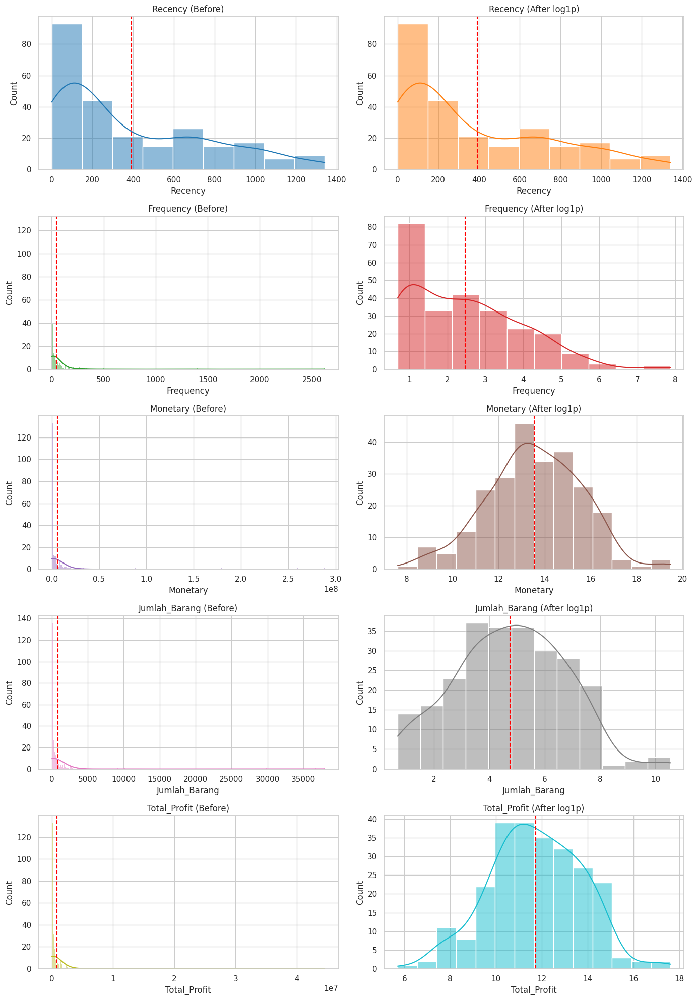
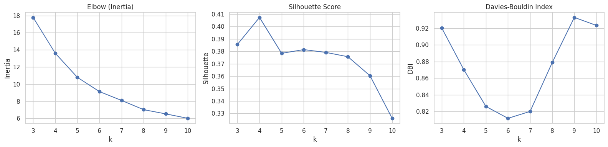
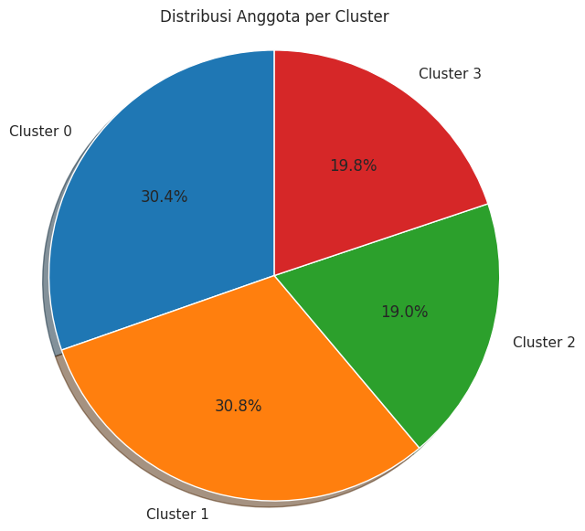
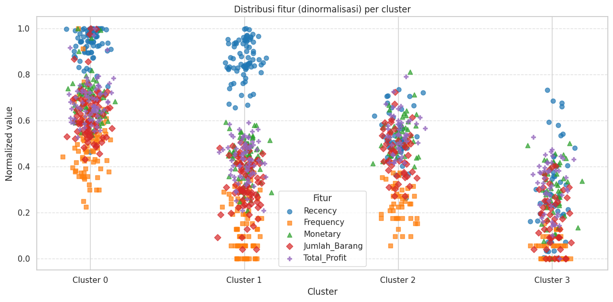
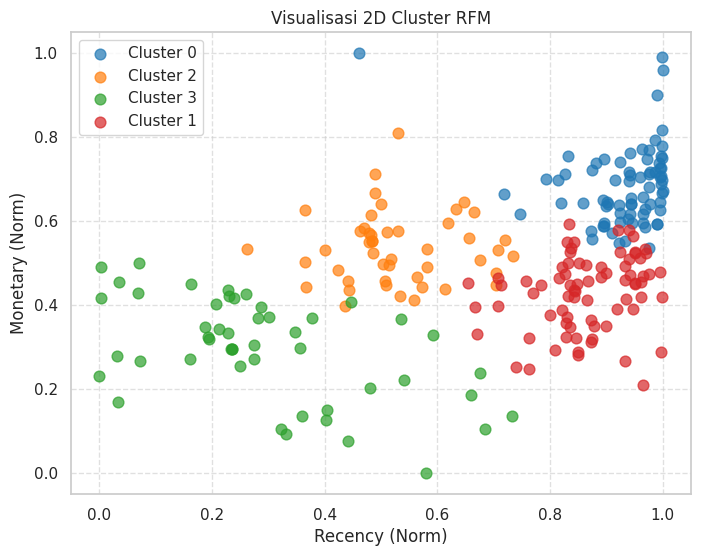
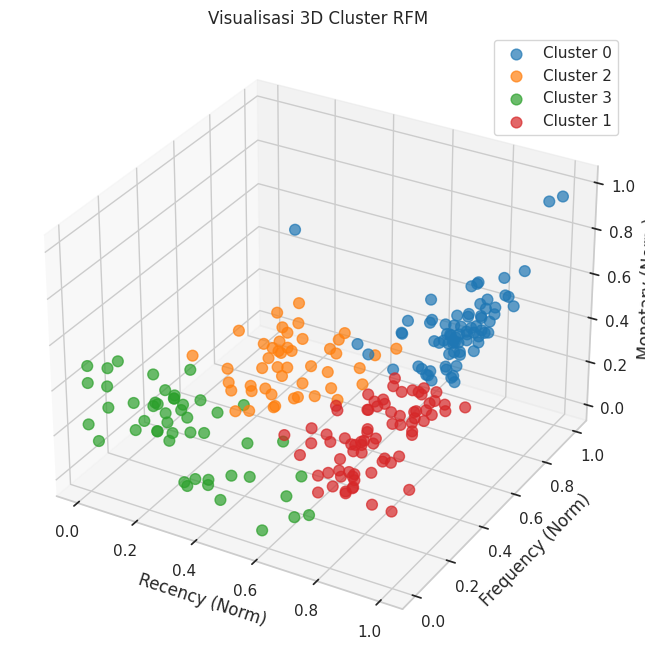

# Customer Segmentation dengan RFM dan K-Means Clustering (2021–2024)
### 📄 Ringkasan Proyek

Proyek ini melakukan segmentasi pelanggan pada data transaksi koperasi menggunakan pendekatan RFM (Recency, Frequency, Monetary) dan algoritma K-Means Clustering.

Dataset mencakup:

48.538 baris data transaksi detail

11.679 transaksi unik

247 pelanggan

Periode transaksi: 2021 – 2024

Tujuan utama segmentasi ini adalah untuk memahami perilaku pelanggan dan membantu bisnis dalam menyusun strategi seperti loyalty program, retensi pelanggan, hingga rekomendasi promosi berbasis data.

### 📄 Persiapan Data
Langkah-langkah yang dilakukan:
1. Menghapus data duplikat.
2. Menangani missing values.
3. Mengubah tipe data tanggal ke datetime.
4. Menyesuaikan data agar hanya memuat transaksi pelanggan.

### 📄 Feature Engineering
Variabel RFM dan tambahan dihitung sebagai berikut:

1. Recency: Jumlah hari sejak transaksi terakhir.
2. Frequency: Total jumlah transaksi dalam periode data.
3. Monetary: Total nilai belanja pelanggan.
4. Jumlah_Barang: Total kuantitas barang dibeli.
5. Total_Profit: Total profit yang dihasilkan pelanggan.

### Pengolahan Data
1. Dilakukan pengecekan dan penanganan skewness untuk mengatasi outlier
Berikut grafik hasil transformasi log

3. Data yang sudah ditransformasi log dinormalisasi dengan min-max
4. pada fitur recency data di balik dengan mengurangi nilai dengan 1

### Pemodelan K-Means
Menentukan Jumlah Cluster
Hasil Elbow dan Silhoutte
 

K terbaik = 4

Hasil Clustering 
 

### Ringkasan karakteristik tiap cluster:
  
Cluster 0 menunjukkan kelompok pelanggan yang masih cukup aktif karena memiliki nilai recency yang tinggi, menandakan transaksi dilakukan baru-baru ini. Namun, aktivitas pembelian lainnya berada pada tingkat menengah; frequency tidak terlalu sering, monetary berada pada level sedang, dan jumlah barang serta total profit yang dihasilkan juga tidak terlalu tinggi. menggambarkan pelanggan yang masih terlibat tetapi belum memberikan nilai pembelian yang besar.

Cluster 1 berisi pelanggan dengan recency yang sangat tinggi, tetapi fitur lainnya—frequency, monetary, jumlah barang, dan total profit—justru rendah. Pola ini mengindikasikan bahwa pelanggan dalam cluster ini baru saja melakukan transaksi, namun intensitas dan nilai pembeliannya kecil. Dengan kata lain, mereka lebih condong sebagai pembeli baru atau pembeli sekali beli yang belum menunjukkan konsistensi dalam bertransaksi.

Cluster 2 menggambarkan kelompok pelanggan yang memiliki aktivitas pembelian yang lebih baik dibanding cluster lain. Mereka memiliki frequency yang lebih stabil, monetary yang cenderung tinggi, serta jumlah barang dan total profit yang relatif besar. Dengan recency yang berada pada tingkat menengah, pelanggan dalam cluster ini dapat dianggap sebagai kelompok bernilai tinggi yang potensial untuk diloyalisasi, karena mereka memberikan kontribusi profit yang lebih besar dan menunjukkan pola pembelian yang konsisten.

Cluster 3 terdiri dari pelanggan yang memiliki recency rendah, menandakan bahwa mereka sudah lama tidak bertransaksi. Selain itu, frequency, monetary, jumlah barang, dan total profit dalam cluster ini juga rendah, sehingga kelompok ini dapat dianggap sebagai pelanggan yang tidak aktif dan memberikan kontribusi paling kecil terhadap total penjualan. Pola ini menunjukkan bahwa pelanggan dalam cluster 3 membutuhkan strategi khusus untuk menarik mereka kembali melakukan pembelian.

### Visualisasi 
 

